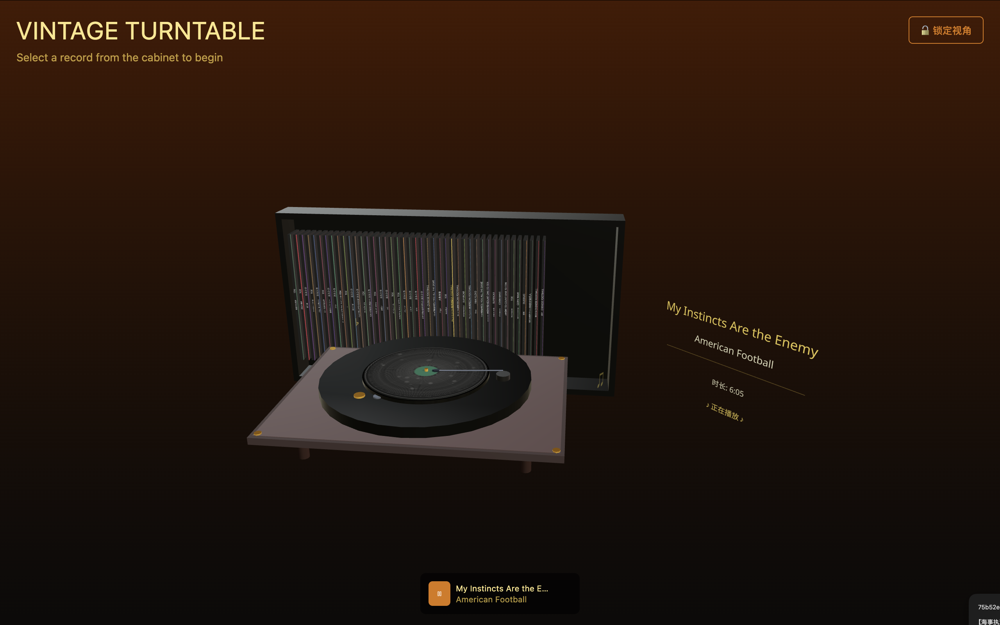

# 🎵 3D 黑胶唱片机 Web 应用



这是一个使用 React、Three.js 和 TypeScript 构建的交互式 3D 黑胶唱片机网页应用。用户可以浏览一个包含44张唱片的虚拟唱片柜，选择任何一张唱片放到唱片机上播放，并享受沉浸式的视觉和听觉体验。

## ✨ 主要功能

- **交互式 3D 场景**: 使用 `react-three-fiber` 和 `drei` 创建了包含唱片柜、唱片机和唱片的精美3D场景。
- **44张唱片收藏**: 内置一个包含44首歌曲的唱片集，涵盖多种音乐风格。
- **真实的唱片播放**:
    - 点击唱片即可在唱片机上播放。
    - 播放时，唱片会带有精美的纹理，并在水平面内平滑旋转。
- **智能信息显示屏**:
    - 悬停在任何唱片上时，会显示该唱片的标题、艺术家和时长。
    - 播放音乐时，显示屏会常亮并显示当前播放的歌曲信息。
- **优雅的音符动画**:
    - 播放音乐时，会有黄色的小音符从唱片机周围缓缓浮现、漂浮并消失。
    - 动画经过优化，保证了流畅的视觉效果。
- **自动播放下一首**: 当前歌曲播放完毕后，系统会自动播放列表中的下一首歌曲，并支持循环播放。
- **流畅的交互体验**:
    - 支持拖拽滑动浏览整个唱片柜。
    - 悬停在唱片上时，相邻的唱片会有联动上升的动画效果。

## 🛠️ 技术栈

- **前端框架**: [React](https://reactjs.org/)
- **3D 渲染**: [Three.js](https://threejs.org/) & [React Three Fiber](https://docs.pmnd.rs/react-three-fiber)
- **辅助工具**: [Drei](https://github.com/pmndrs/drei) (用于 `react-three-fiber` 的实用工具集)
- **构建工具**: [Vite](https://vitejs.dev/)
- **语言**: [TypeScript](https://www.typescriptlang.org/)
- **样式**: [Tailwind CSS](https://tailwindcss.com/)

## 🚀 如何运行

1.  **克隆仓库**
    ```bash
    git clone https://github.com/cnYui/3D-Vinyl-Turntable-Web-Application.git
    cd 3D-Vinyl-Turntable-Web-Application
    ```

2.  **安装依赖**
    ```bash
    npm install
    ```

3.  **启动开发服务器**
    ```bash
    npm run dev
    ```
    应用将在 `http://localhost:3000` (或另一个可用端口) 上运行。

4.  **自动生成唱片数据** (可选)
    如果您在 `public/audio` 目录下添加了新的 `.mp3` 文件，可以运行以下脚本来自动更新 `src/data/vinylCollection.ts` 文件：
    ```bash
    node scripts/generateVinylCollection.js
    ```

## 📂 项目结构

```
/
├── public/
│   └── audio/              # 存放所有音频文件
├── src/
│   ├── components/         # React 组件
│   │   ├── ui/             # UI 组件 (由 shadcn/ui 生成)
│   │   ├── AudioProvider.tsx # 音频状态管理
│   │   ├── GlassCabinet.tsx  # 唱片柜
│   │   ├── MusicNotes.tsx    # 音符动画
│   │   └── Turntable.tsx     # 唱片机
│   ├── data/
│   │   └── vinylCollection.ts # 唱片数据
│   └── ...
├── scripts/
│   └── generateVinylCollection.js # 自动生成唱片数据的脚本
├── README.md               # 项目说明
└── package.json